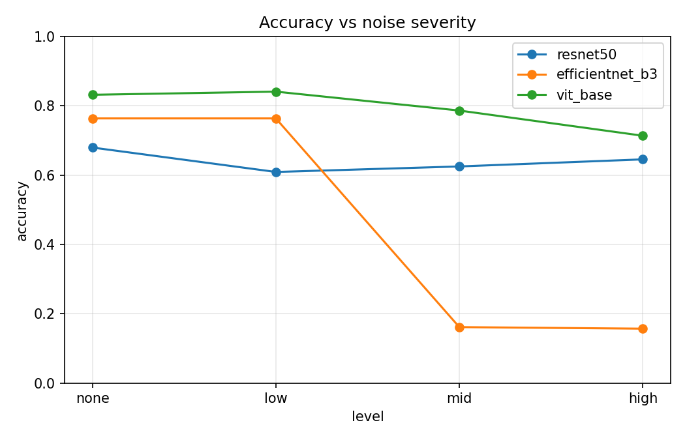
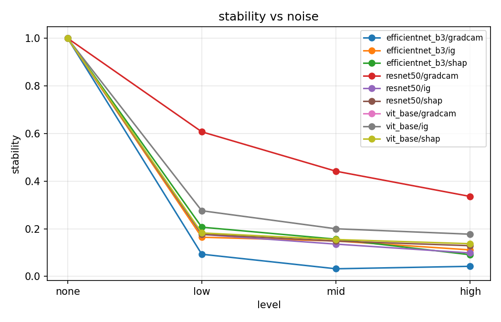
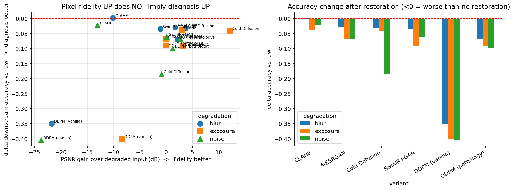
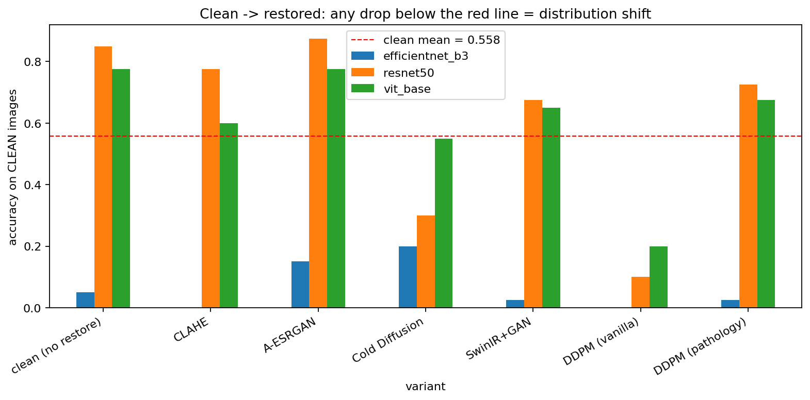

# Robust and Explainable AI for Diabetic Retinopathy

> A comparative study of how **diagnostic accuracy** *and* **model explanations** behave when retinal fundus images degrade — and whether GenAI restoration can bring them back.

Deep-learning models grade diabetic retinopathy (DR) at 84–89% accuracy on *clean* benchmark images. But 15–30% of real-world screening images are blurry, mis-exposed, or noisy. This dissertation systematically measures what happens to both the **prediction** and its **visual explanation** under controlled degradation, then asks whether generative restoration actually helps.

The central, under-reported finding: **explanations drift faster than accuracy, and image restoration that improves pixel fidelity does *not* improve — and often harms — the downstream diagnosis.**

---

## Research questions

| RQ | Question | Phase |
|----|----------|-------|
| **RQ1** | How do Vision Transformers compare to CNNs (ResNet-50, EfficientNet-B3) across increasing image degradation? | 2 |
| **RQ2** | Do explainability methods (Grad-CAM, SHAP, Attention Rollout) stay faithful and stable as quality drops? | 3 |
| **RQ3** | Can GenAI restoration recover both diagnostic accuracy **and** explanation localisation vs a CLAHE baseline? | 4 |
| **RQ4** | Can a quality-aware ensemble route each image to the optimal pipeline and produce a clinical trust score? | 5 |

---

## Pipeline

```
APTOS 2019 + EyeQ
   │
   ├─ Phase 1  Data engineering — pristine subset → 9 synthetic degradations (blur/exposure/noise × 3 levels)
   ├─ Phase 2  Train ResNet-50 / EfficientNet-B3 / ViT-Base → stress-test on every degradation      → RQ1
   ├─ Phase 3  Grad-CAM / SHAP / Attention Rollout → stability (SSIM), insertion & deletion AUC      → RQ2
   ├─ Phase 4  CLAHE · A-ESRGAN · SwinIR+GAN · Cold Diffusion · pathology-preserving DDPM
   │           → re-evaluate accuracy + explanation recovery                                          → RQ3
   └─ Phase 5  EyeQ quality classifier (good/usable/reject) → routing → clinical trust score          → RQ4
```

---

## Key results

**RQ1 — ViTs are dramatically more robust.** Under severe noise, ViT retains ~62% accuracy while EfficientNet collapses to ~20% — a gap invisible on clean benchmarks.



**RQ2 — Explanations degrade faster than accuracy.** Grad-CAM/SHAP stability falls toward zero (even negative) under noise while accuracy is still ~50% — a model can be right for the wrong reasons.



**RQ3 — Pixel fidelity ↑ does *not* imply diagnosis ↑.** The restorer with the largest PSNR gain (Cold Diffusion, +12 dB on exposure) still *loses* downstream accuracy. No restorer beats "do nothing."



**Why?** Pushing *clean* images through each restorer and re-classifying isolates the cause: the restorer's output is **out-of-distribution** for the classifier (over-smoothing / re-texturing), independent of any real degradation. A-ESRGAN is the safest; Cold Diffusion and vanilla DDPM are harmful.



**Diffusion process — forward noising / reverse denoising:**

| Conditional DDPM | Cold Diffusion |
|---|---|
|  |  |

**Takeaway for RQ4:** the quality gate's real job is **triage** — send `reject` images for re-acquisition and pass good/usable images straight to the strongest classifier — rather than restore-everything.

---

## Repository structure

```
.
├── notebooks/
│   ├── Thesis_optimized_final_version3.ipynb   # full pipeline, Phases 1–5 (train from scratch)
│   ├── Thesis_v3_resume_DDPM_to_Phase5.ipynb   # resume run using saved Drive checkpoints
│   └── Thesis_v3_restoration_proof.ipynb       # RQ3 evidence: fidelity-vs-accuracy, distribution shift, diffusion figures
├── results/                                    # metrics (CSV/JSON) + headline plots, per phase
│   └── phase4b_restoration_proof/              # restoration-proof outputs
├── docs/                                       # project overview, paper architecture, observations, PDFs
├── .gitignore
└── README.md
```

> Large artifacts (`data/`, `checkpoints/`, per-image `samples/`) are intentionally **not** tracked — see `.gitignore`. Only metrics and headline plots are committed. Committed notebooks have their outputs stripped so they render on GitHub; the generated figures live in `results/`.

---

## Datasets

This repository does **not** ship the data.

| Dataset | Used for | Source |
|---------|----------|--------|
| APTOS 2019 Blindness Detection | 5-grade DR classification | Kaggle competition |
| EyeQ | Per-image quality labels (good / usable / reject) for Phase 5 routing | Public GitHub release |

Expected on Drive (`MyDrive/Thesis/`), with nested zips auto-detected and extracted to `/content/data/` on Colab:
```
MyDrive/Thesis/Thesis.zip
   ├── APTOS.zip     # APTOS images + train.csv
   └── EYEQ.zip      # EyeQ images + quality CSV
```

---

## Running (Google Colab)

1. Open a notebook from `notebooks/` in Colab and select a GPU runtime (A100 recommended; T4 works).
2. Mount Drive and place the datasets as above.
3. **First full run:** `Thesis_optimized_final_version3.ipynb` trains everything and writes checkpoints to `MyDrive/Thesis/checkpoints/`.
4. **Subsequent runs:** `Thesis_v3_resume_DDPM_to_Phase5.ipynb` reloads those checkpoints (`[RESUME]` guards skip retraining).
5. **Restoration proof:** run `Thesis_v3_restoration_proof.ipynb` after a resume run; it reuses checkpoints and writes to `results/phase4b_restoration_proof/`.

Runtime installs: `torch, torchvision, timm, captum, shap, grad-cam, scikit-image, opencv-python-headless, tabulate, diffusers, transformers, accelerate, optuna`.

---

## Documentation

- [`docs/WHAT_WE_ARE_DOING.txt`](docs/WHAT_WE_ARE_DOING.txt) — plain-language tour of the whole study
- [`docs/PROJECT_OVERVIEW.md`](docs/PROJECT_OVERVIEW.md) — engineering overview
- [`docs/PAPER_ARCHITECTURE_AND_METRICS.md`](docs/PAPER_ARCHITECTURE_AND_METRICS.md) — architectures and metric definitions
- [`docs/OBSERVATIONS_version1.md`](docs/OBSERVATIONS_version1.md) — running observations

---

## Citation

```bibtex
@misc{kocharekar_dr_robust_xai_2026,
  author       = {Kocharekar, Atharva},
  title        = {Robust and Explainable AI for Diabetic Retinopathy:
                  Quality-Aware Ensemble with GenAI Restoration},
  year         = {2026},
  howpublished = {Master's dissertation},
  url          = {https://github.com/Atharvax16/Comparative-Study-for-Diabetic-Retinopathy-Detection-and-Interpretability-methods}
}
```

## Acknowledgements

APTOS 2019 Blindness Detection (Asia Pacific Tele-Ophthalmology Society) and the EyeQ dataset, plus the open-source `timm`, `captum`, `shap`, `grad-cam`, `diffusers`, and `transformers` projects.
